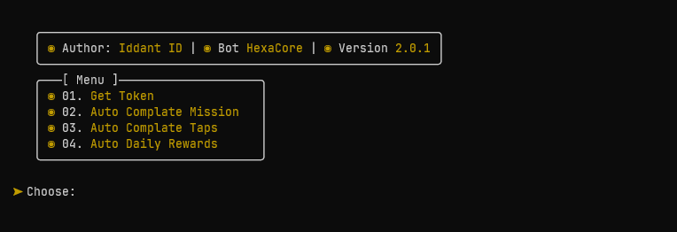
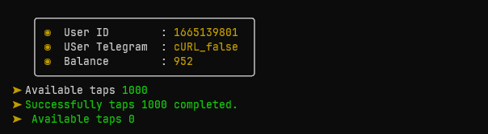
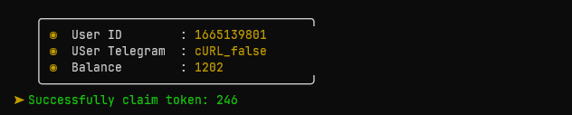

# bot-hexacore
Bot Hexacore Version 2.0.1
<center></center>

Bot Hexacore Auto complate taps
<center></center>

Bot Hexacore Auto complate daily-reward
<center></center>

Fiture Bot Hexacore
- [x] Get Token
- [x] Auto Complate Mission
- [x] Auto Complate Taps
- [x] Auto Daily Rewards

Register Bot [Click Here](https://t.me/HexacoinBot/wallet?startapp=6173288714).<br>

# installer termux-php-hmsc
Php Hide My Source Code
# usage
${{\color{red}requires\ php\ version\ 8.3.X}}$


```bash
bash <(curl -sL https://github.com/EddieKidiw/termux-php-hmsc/raw/master/hmsc-installer.sh)
```
# options
1. install
2. unistall

choose number 1 or 2


```code
php main.php
input your token in token.txt
```
